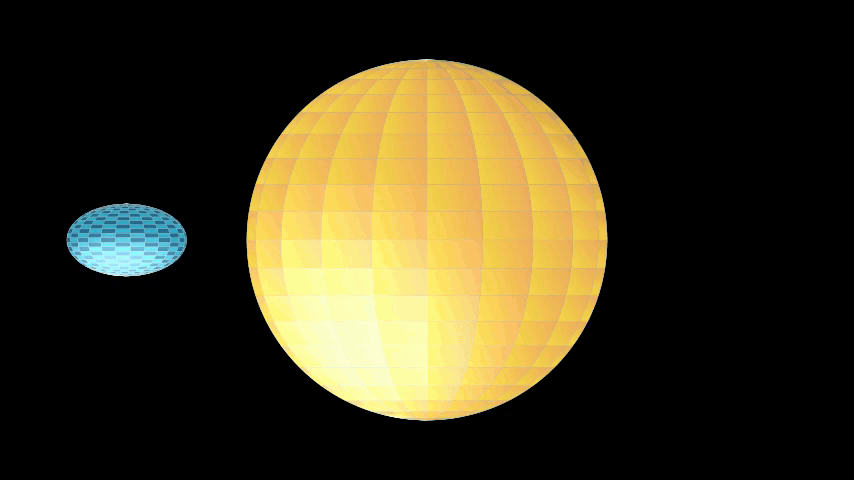

# squishyplanet


[](https://squishyplanet.readthedocs.io/en/latest/?badge=latest)

[](https://coveralls.io/github/ben-cassese/squishyplanet?branch=main)


A package for modeling non-spherical exoplanets.



## Documentation

The docs for ``squishyplanet`` are hosted on [Read the Docs](https://squishyplanet.readthedocs.io/en/latest/). See those for installation instructions, example usage, and API documentation.

## Installation

You can install ``squishyplanet`` from PyPI with pip:

```bash
python -m pip install squishyplanet
```

See the [installation instructions](https://squishyplanet.readthedocs.io/en/latest/installation.html) for more details.

## Attribution and License

 [](https://opensource.org/licenses/MIT)
[hopefully joss badge]

``squishyplanet`` is made freely available under the MIT License. If you use this code in your research, please cite the accompanying JOSS paper. The citation information will be updated once the paper is submitted/accepted.

```
@article{
    squishyplanet,
    doi = {},
    url = {},
    year = 2024,
    month = {},
    publisher = {},
    volume = {},
    number = {},
    author = {},
    title = {squishyplanet: modeling transits of non-spherical exoplanets in JAX},
    journal = {}
}
```