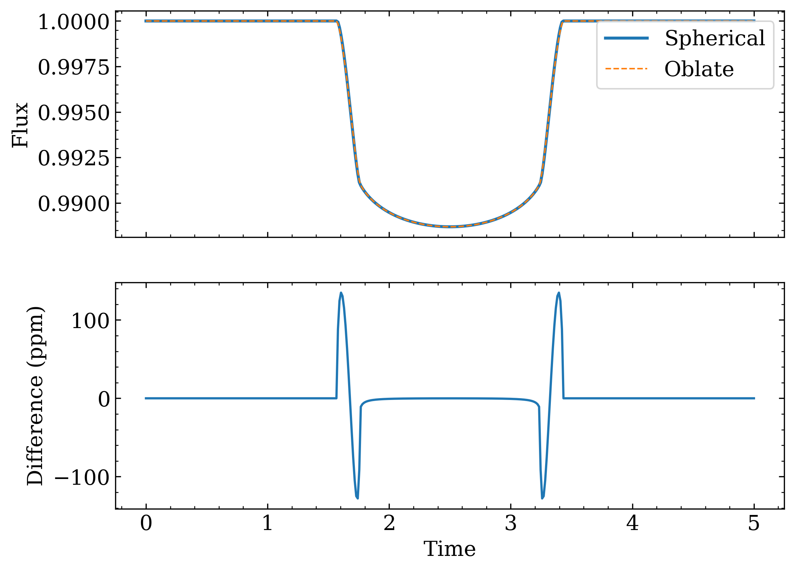

<!-- .. squishyplanet documentation master file, created by
   sphinx-quickstart on Mon Apr 15 08:10:41 2024.
   You can adapt this file completely to your liking, but it should at least
   contain the root `toctree` directive. -->

squishyplanet
=============

``squishyplanet`` is a relatively lightweight package for creating transit light curves
and phase curves of non-spherical exoplanets. It can generate the model, but then
leaves the choice of inference framework up to you.

We recommend that potential users start with the [geometry visualizations](geometry.md)
to get a sense of the coordinate system and how the planet is defined. 

## A summary:

<span style="font-size:larger;">Transits</span>

The transit portion can handle arbitrary
order polynomial limb darkening by following most of the algorithm presented in
[Agol, Luger, and Foreman-Mackey 2020](https://ui.adsabs.harvard.edu/abs/2020AJ....159..123A/abstract).
However, where that publication pushes through to derive analytic expressions (which is
possible but challenging when working with spherical planets), we don't even attempt 
such wizardry for our triaxial planets and instead numerically integrate the final
flux-blocking step.

Even with this reliance on numerical solutions though, thanks to `JAX` and its ability 
to just-in-time compile functions, these transit integrals are still relatively fast. 
Users computing transits only can expect speeds slightly slower than but comparable to 
[jaxoplanet](https://jax.exoplanet.codes/en/latest/). Also, in the limiting case where 
the planet is forced to be spherical, `squishyplanet` is designed to be just as accurate
as `jaxoplanet`. See the [Compare with jaxo/exoplanet notebook](tutorials/lightcurve_compare.ipynb)
for more details.

From the [quickstart](quickstart.ipynb) guide:



<span style="font-size:larger;">Phase Curves</span>

`squishyplanet` can also compute reflected and emitted phase curves from the planet, as
well as simple ellipsoidal and doppler variations from the star. Admittedly, the
implementation of these features is much more crude than the transit portion: where that
involves a lot of math/optimization, any component involving the planet is calculated 
via brute-force Monte Carlo integration. So, while the transit portion is relatively fast,
users should expect phase curve evaluations to be much slower, on the order of 100s of
ms per evaluation.

## Attribution

\[insert JOSS citation/bibtex here someday\]

```{toctree}
:maxdepth: 1
:hidden:
:caption: User Guide

installation
quickstart
geometry
```

```{toctree}
:maxdepth: 1
:hidden:
:caption: Tutorials/Demos

tutorials/create_a_lightcurve.ipynb
tutorials/illustrations.ipynb
tutorials/lightcurve_compare.ipynb
tutorials/create_a_phase_curve.ipynb
tutorials/fit_a_transit.ipynb
```


```{toctree}
:maxdepth: 1
:hidden:
:caption: API

api
```
